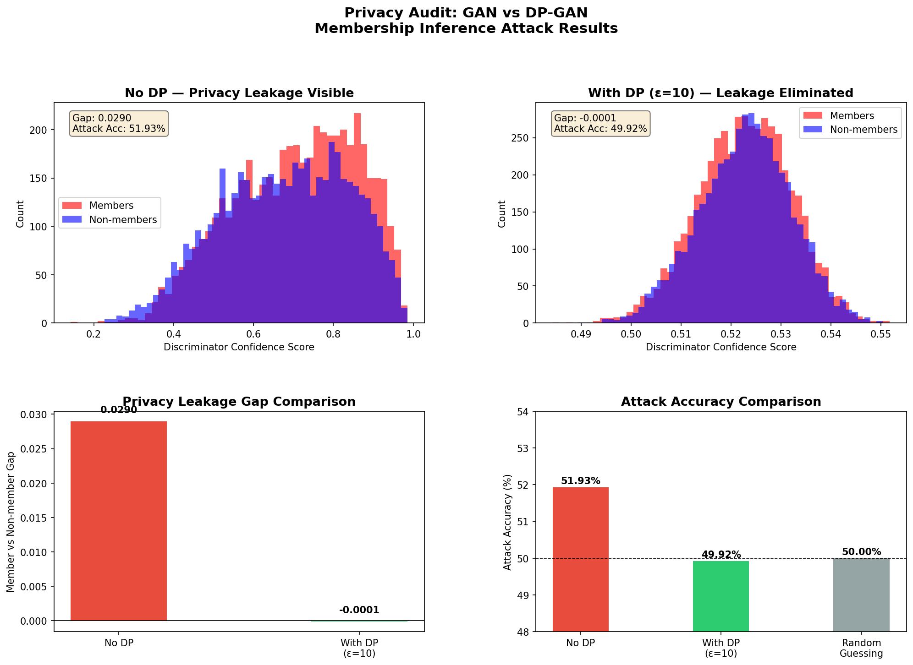

# GenAI Privacy Audit: Membership Inference Attacks on Generative Models

A research project auditing privacy leakage in GANs using membership inference 
attacks, with Differential Privacy (DP-SGD) as a defense mechanism.

**Key Result:** DP reduced membership inference attack accuracy from 51.93% to 
49.92% which is below random guessing while eliminating the privacy leakage gap 
from 0.0290 to -0.0001.

---

## Results

| Model | Member Confidence | Non-member Confidence | Gap | Attack Accuracy |
|---|---|---|---|---|
| GAN (no DP) | 0.7057 | 0.6767 | 0.0290 | 51.93% |
| DP-GAN (ε=10) | 0.5227 | 0.5228 | -0.0001 | 49.92% |



---

## Project Structure

```
├── train_gan.py               # Train baseline GAN on MNIST
├── membership_inference.py    # Attack baseline GAN
├── train_gan_dp.py            # Train GAN with DP-SGD defense
├── membership_inference_dp.py # Attack DP-GAN
├── compare_results.py         # Generate comparison figures
└── outputs/                   # Saved models and figures
```

## Setup

```bash
python3 -m venv research-env
source research-env/bin/activate
pip install torch torchvision opacus matplotlib
```

## Run

```bash
# Train and attack baseline GAN
python train_gan.py
python membership_inference.py

# Train and attack DP-GAN
python train_gan_dp.py
python membership_inference_dp.py

# Generate comparison figures
python compare_results.py
```

---

*Inspired by research on privacy in generative AI: see paper.tex for full write-up.*